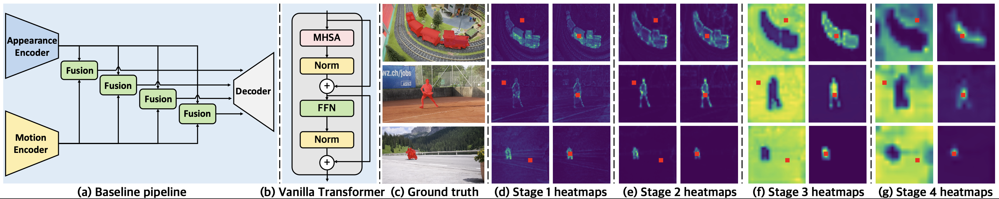
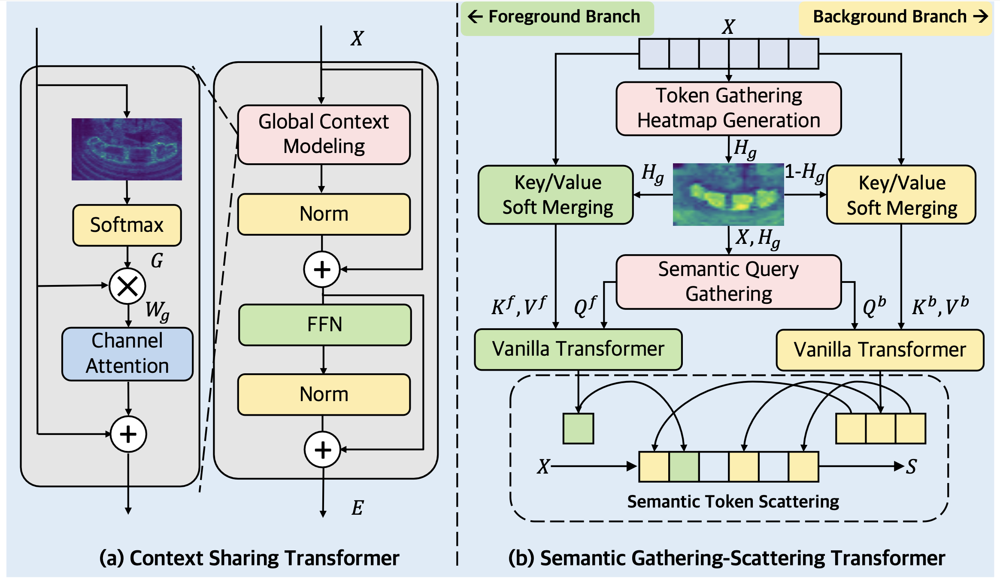
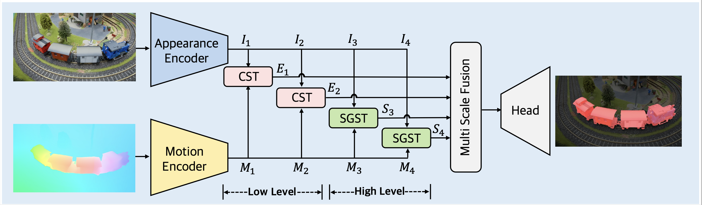
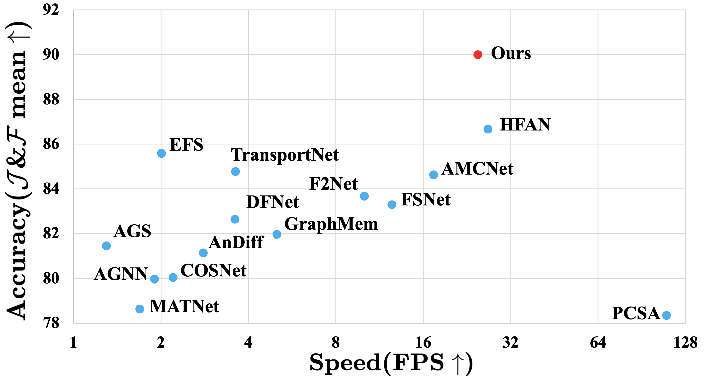
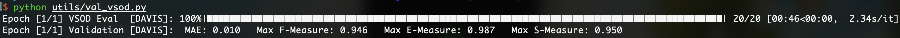
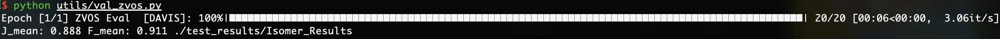

# Isomer
[[ICCV2023] Isomer: Isomerous Transformer for Zero-Shot Video Object Segmentation](https://github.com/DLUT-yyc/Isomer/blob/master/docs/ICCV2023_Isomer.pdf)

## To Do List
- [x] Release our camera-ready paper.
- [x] Release our codebase.
- [x] Release our dataset.
- [x] Release our model checkpoints.
- [x] Release our segmentation maps.

## Introduction
Recent leading zero-shot video object segmentation (ZVOS) works devote to integrating appearance and motion information by elaborately designing feature fusion modules and identically applying them in multiple feature stages. Our preliminary experiments show that with the strong long-range dependency modeling capacity of Transformer, simply concatenating the two modality features and feeding them to vanilla Transformers for feature fusion can distinctly benefit the performance but at a cost of heavy computation. Through further empirical analysis, we find that attention dependencies learned in Transformer in different stages exhibit completely different properties: global query-independent dependency in the low-level stages and semantic-specific dependency in the high-level stages. 

Motivated by the observations, we propose two Transformer variants: i) Context-Sharing Transformer (CST) that learns the global-shared contextual information within image frames with a lightweight computation. ii) Semantic Gathering-Scattering Transformer (SGST) that models the semantic correlation separately for the foreground and background and reduces the computation cost with a soft token merging mechanism. 

We apply CST and SGST for low-level and high-level feature fusions, respectively, formulating a level-isomerous Transformer framework for ZVOS task. 

Compared with the existing ZVOS works, our method obtains significantly superior performance with real-time inference. 



## Installation

The code requires `python>=3.7`, as well as `pytorch>=1.7` and `torchvision>=0.8`. 

## Preparation

Download pretrained models, datasets, final checkpoints and results from [here](https://pan.baidu.com/s/1PJ8JevkmLwaoUVwcScQvCQ) (passwd: iiau).

Please organize the files as follows:

```
dataset/
  TrainSet/
  TestSet/
Isomer/
  checkpoints/
    isomer.pth
  pretrained_model/
    mit_b0.pth
    swin_tiny_patch4_window7_224.pth
  test_results/
    Isomer_Results/
  tools/
  ...
```

## Training

```
# run scripts/train.sh
./scripts/train.sh
```

## Inference

```
# run scripts/infer.sh
./scripts/infer.sh
```

## Evaluation

```
# For ZVOS
python utils/val_zvos.py

# For VSOD
python utils/val_vsod.py
```
We optimized the evaluation codes of ZVOS and VSOD tasks to enable faster evaluation:



## License

The model is licensed under the [Apache 2.0 license](LICENSE).
